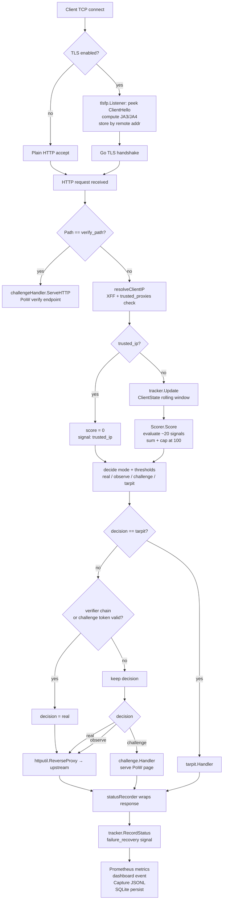

# How VeilGate Processes a Request

This page describes the runtime flow implemented by `cmd/veilgate` and
`internal/proxy`. It is similar in purpose to NGINX request-processing
documentation, but the phases are VeilGate-specific: resolve client identity,
score, decide, handle, and record.

## Request Processing Flowchart



## Example Configuration

```yaml
listen: ":8080"
upstream: "http://localhost:3000"
mode: "observe"
rules_dir: "./rules"

detector:
  score_challenge_threshold: 40
  score_tarpit_threshold: 70
  trusted_ips: []
  trusted_proxies: []

metrics:
  listen: "127.0.0.1:9090"
```

## Processing Phases

1. Client connects to the VeilGate listener.
2. TLS is terminated if `tls.enabled` is true; JA3/JA4 fingerprint is captured.
3. HTTP/2 SETTINGS fingerprint data is classified when captured.
4. Verify-path shortcut check: the PoW verify endpoint is served before scoring.
5. Client identity is resolved via XFF + trusted_proxies.
6. The request is recorded into the detector tracker (rolling window).
7. Detector signals are evaluated: ~20 stateless and stateful signals.
8. Signal points are summed and capped at 100.
9. `mode` and thresholds select a decision: `real`, `observe`, `challenge`, `tarpit`.
10. Verifier and challenge-token bypass are applied for non-tarpit decisions.
11. The selected handler runs (upstream proxy, challenge page, or tarpit).
12. Telemetry, capture, persistence, and response status are recorded.

## Phase 1: Listener

The `listen` field controls the proxy listener. `cmd/veilgate/main.go` creates
the main HTTP server with `cfg.Listen` as its address. If `tls.enabled` is
false, the server uses `ListenAndServe`. If `tls.enabled` is true,
`listenTLS()` wraps the TCP listener with `internal/tlsfp.Listener` before
serving TLS.

Code path:

- [`cmd/veilgate/main.go`](../../cmd/veilgate/main.go)
- [`internal/tlsfp/listener.go`](../../internal/tlsfp/listener.go)

Validation:

```bash
curl -i http://localhost:8080/
```

## Phase 2: TLS Fingerprint Capture

When TLS is enabled, VeilGate peeks at the ClientHello and computes JA3/JA4
data before Go's TLS stack consumes the connection. The classifier compares the
fingerprint with `rules/tls_fingerprints.yaml`.

This phase is skipped when TLS is terminated before VeilGate. In that topology,
JA3/JA4 signal quality is lost at the VeilGate layer.

Code path:

- [`internal/tlsfp/ja4.go`](../../internal/tlsfp/ja4.go)
- [`internal/tlsfp/database.go`](../../internal/tlsfp/database.go)
- [`internal/detector/tls.go`](../../internal/detector/tls.go)

## Phase 2B: HTTP/2 Fingerprint Classification

VeilGate wires an HTTP/2 SETTINGS fingerprint store and classifier into the
detector. When a connection hook captures HTTP/2 settings for a remote address,
the detector can classify the request as `h2_agent`, `h2_bot`, or
`h2_non_browser`.

The current repository does not include a YAML loader for
`rules/h2_fingerprints.yaml`. Exact HTTP/2 entries must be applied by code; the
minimal-settings heuristic can still identify library-shaped clients when
settings are captured.

Code path:

- [`internal/h2fp/h2fp.go`](../../internal/h2fp/h2fp.go)
- [`cmd/veilgate/main.go`](../../cmd/veilgate/main.go)
- [`internal/detector/scorer.go`](../../internal/detector/scorer.go)

Related: [Module veilgate_http2_fingerprinting](../modules/veilgate_http2_fingerprinting.md).

## Phase 2C: Verify-Path Shortcut

Before scoring, `serve()` checks whether the request path matches the configured
`verify_path` (default: `/__veilgate/verify`). If it does, the challenge handler
processes it immediately and returns. No scoring, no tracking, no upstream proxy.

```go
// internal/proxy/proxy.go
if s.challengeHandler != nil && r.URL.Path == s.challengeHandler.VerifyPath() {
    s.challengeHandler.ServeHTTP(w, r)
    return
}
```

This path must not be forwarded to the upstream application.

## Phase 3: Client Identity

The proxy resolves an effective client ID before scoring. By default, it uses
the direct remote address. It trusts `X-Forwarded-For` only when the direct peer
matches `detector.trusted_proxies`.

This prevents scanners from injecting arbitrary strings or spoofed IPs into
forwarded headers and corrupting detector state.

Code path:

- [`internal/proxy/proxy.go`](../../internal/proxy/proxy.go) → `resolveClientIP()`
- [`internal/proxy/proxy.go`](../../internal/proxy/proxy.go) → `ParseTrustedProxies()`

Validation:

```bash
curl -H "X-Forwarded-For: 127.0.0.1" http://localhost:8080/
```

If the direct peer is not trusted, the spoofed header must not become the
client ID.

## Phase 4: Tracker Update

`internal/detector.Tracker` keeps rolling per-client request history. Stateful
signals use this history for timing regularity, path fanout, request graph
shape, cookie ecology, failure recovery, UA rotation, and toolchain sequencing.

The window size is controlled by `detector.window_seconds`.

`ClientState` fields updated:

| Field | Used by signal |
| --- | --- |
| `Events[]` | timing, request_graph, fanout, toolchain_hmm |
| `HoneypotHits` | honeypot_hit |
| `UniqueUAs` | ua_rotation |
| `LastStatus` | failure_recovery |
| `CookiesSent` | cookie_ecology |
| `DocumentFetches` / `SubresourceFetches` | sec_fetch_mismatch |

Code path:

- [`internal/detector/tracker.go`](../../internal/detector/tracker.go)
- [`internal/detector/scorer.go`](../../internal/detector/scorer.go)

## Phase 5: Detector Signals

`internal/detector.Scorer.Score()` evaluates stateless and stateful signals.
Signal groups include:

- suspicious user agents;
- sparse browser headers (Accept, Accept-Language, Accept-Encoding, Sec-Fetch-*);
- honeypot paths;
- scanner wordlist paths;
- SQLi, XSS, path traversal, Log4Shell, and OOB markers;
- IP reputation (CIDR categories, Tor exit, cloud provider, known scanner ranges);
- fleet rotation and UA rotation (behavior fingerprinting);
- TLS (JA3/JA4) and HTTP/2 fingerprints;
- timing regularity and toolchain HMM;
- tarpit canary replay;
- optional ML agent score.

Signals are additive. The final score is capped at `100`.

Code path:

- [`internal/detector/scorer.go`](../../internal/detector/scorer.go)
- [`internal/detector/fleet.go`](../../internal/detector/fleet.go)
- [`internal/ml/scorer.go`](../../internal/ml/scorer.go)
- [`rules/detector.yaml`](../../rules/detector.yaml)

See also: [Detector signal flow internals](../internals/detector_signal_flow.md).

## Phase 6: Decision Selection

The proxy maps score and `mode` into a decision:

| Mode | Score range | Decision |
| --- | --- | --- |
| `observe` | any | `observe` (always proxied) |
| `challenge` | `< challenge_threshold` | `real` |
| `challenge` | `>= challenge_threshold` | `challenge` |
| `tarpit` | `< challenge_threshold` | `real` |
| `tarpit` | `[challenge_threshold, tarpit_threshold)` | `challenge` |
| `tarpit` | `>= tarpit_threshold` | `tarpit` |
| `auto` | `< challenge_threshold` | `real` |
| `auto` | `[challenge_threshold, tarpit_threshold)` | `challenge` |
| `auto` | `>= tarpit_threshold` | `tarpit` |

Code path:

- [`internal/proxy/proxy.go`](../../internal/proxy/proxy.go) → `decide(score int)`

## Phase 7: Verifier and Challenge Bypass

For decisions other than `tarpit`, the proxy checks the verifier chain and then
the challenge token. A valid HMAC verifier or valid challenge cookie/header can
move the decision back to `real`.

A tarpit decision is intentionally not bypassed. This prevents a stolen cookie
or leaked verifier secret from hiding high-confidence attack-tier behavior.

Code path:

- [`internal/proxy/proxy.go`](../../internal/proxy/proxy.go)
- [`internal/verifier/verifier.go`](../../internal/verifier/verifier.go)
- [`internal/challenge/challenge.go`](../../internal/challenge/challenge.go) → `Passed()`

## Phase 8: Handler Dispatch

The final handler is selected by the decision:

| Decision | Handler |
| --- | --- |
| `real` | `httputil.NewSingleHostReverseProxy` to `upstream`. |
| `observe` | Same upstream proxy, with observe decision recorded. |
| `challenge` | `internal/challenge.Handler` — serves PoW page. |
| `tarpit` | `internal/tarpit.Handler` — serves fake application response. |

The reverse proxy uses a `statusRecorder` wrapper to capture the HTTP status
code for later feedback into the tracker.

Code path:

- [`internal/proxy/proxy.go`](../../internal/proxy/proxy.go) → `serve()`
- [`internal/challenge/challenge.go`](../../internal/challenge/challenge.go)
- [`internal/tarpit/handler.go`](../../internal/tarpit/handler.go)

## Phase 9: Telemetry and Persistence

After scoring and after handler execution, VeilGate records:

- Prometheus metrics via `internal/telemetry/metrics.go`.
- Built-in dashboard events via `internal/telemetry/dashboard.go`.
- Optional JSONL capture events via `internal/telemetry/capture.go`.
- Optional SQLite persistence events via `internal/persist/store.go`.
- Response status back into the tracker via `tracker.RecordStatus()` for the
  `failure_recovery` signal.

Code path:

- [`internal/telemetry/metrics.go`](../../internal/telemetry/metrics.go)
- [`internal/telemetry/dashboard.go`](../../internal/telemetry/dashboard.go)
- [`internal/telemetry/capture.go`](../../internal/telemetry/capture.go)
- [`internal/persist/store.go`](../../internal/persist/store.go)

Validation:

```bash
curl http://127.0.0.1:9090/metrics | grep veilgate_requests_total
curl http://127.0.0.1:9090/metrics | grep veilgate_signal_hits_total
```

## Limitations

VeilGate does not patch vulnerable applications, replace authentication,
provide general DDoS protection, or guarantee that all automated clients are
blocked. It changes request handling based on observable behavior and operator
rules. Operators must tune it against their traffic.

## Related

- [Module veilgate_proxy](../modules/veilgate_proxy.md)
- [Module veilgate_detector](../modules/veilgate_detector.md)
- [Detector signal flow](../internals/detector_signal_flow.md)
- [Tarpit rendering flow](../internals/tarpit_rendering_flow.md)
- [Persistence flow](../internals/persistence_flow.md)

## Example Configuration

```yaml
listen: ":8080"
upstream: "http://localhost:3000"
mode: "observe"
rules_dir: "./rules"

detector:
  score_challenge_threshold: 40
  score_tarpit_threshold: 70
  trusted_ips: []
  trusted_proxies: []

metrics:
  listen: "127.0.0.1:9090"
```

## Processing Phases

1. Client connects to the VeilGate listener.
2. TLS is terminated if `tls.enabled` is true.
3. HTTP/2 SETTINGS fingerprint data is classified when captured.
4. Client identity is resolved.
5. The request is recorded into the detector tracker.
6. Detector signals are evaluated.
7. Signal points are added and capped at `100`.
8. `mode` and thresholds select a decision.
9. Verifier and challenge-token bypass are applied for non-tarpit requests.
10. The selected handler runs.
11. Telemetry, capture, persistence, and response status are recorded.

## Phase 1: Listener

The `listen` field controls the proxy listener. `cmd/veilgate/main.go` creates
the main HTTP server with `cfg.Listen` as its address. If `tls.enabled` is
false, the server uses `ListenAndServe`. If `tls.enabled` is true,
`listenTLS()` wraps the TCP listener with `internal/tlsfp.Listener` before
serving TLS.

Code path:

- [`cmd/veilgate/main.go`](../../cmd/veilgate/main.go)
- [`cmd/veilgate/main.go#L71`](../../cmd/veilgate/main.go#L71)
- [`internal/tlsfp/listener.go`](../../internal/tlsfp/listener.go)

Validation:

```bash
curl -i http://localhost:8080/
```

## Phase 2: TLS Fingerprint Capture

When TLS is enabled, VeilGate peeks at the ClientHello and computes JA3/JA4
data before Go's TLS stack consumes the connection. The classifier compares the
fingerprint with `rules/tls_fingerprints.yaml`.

This phase is skipped when TLS is terminated before VeilGate. In that topology,
JA3/JA4 signal quality is lost at the VeilGate layer.

Code path:

- [`internal/tlsfp/ja4.go`](../../internal/tlsfp/ja4.go)
- [`internal/tlsfp/database.go`](../../internal/tlsfp/database.go)
- [`internal/detector/tls.go`](../../internal/detector/tls.go)

## Phase 2B: HTTP/2 Fingerprint Classification

VeilGate wires an HTTP/2 SETTINGS fingerprint store and classifier into the
detector. When a connection hook captures HTTP/2 settings for a remote address,
the detector can classify the request as `h2_agent`, `h2_bot`, or
`h2_non_browser`.

The current repository does not include a YAML loader for
`rules/h2_fingerprints.yaml`. Exact HTTP/2 entries must be applied by code; the
minimal-settings heuristic can still identify library-shaped clients when
settings are captured.

Code path:

- [`internal/h2fp/h2fp.go`](../../internal/h2fp/h2fp.go)
- [`cmd/veilgate/main.go`](../../cmd/veilgate/main.go)
- [`internal/detector/scorer.go`](../../internal/detector/scorer.go)

Related: [Module veilgate_http2_fingerprinting](../modules/veilgate_http2_fingerprinting.md).

## Phase 3: Client Identity

The proxy resolves an effective client ID before scoring. By default, it uses
the direct remote address. It trusts `X-Forwarded-For` only when the direct peer
matches `detector.trusted_proxies`.

This prevents scanners from injecting arbitrary strings or spoofed IPs into
forwarded headers and corrupting detector state.

Code path:

- [`internal/proxy/proxy.go#L390`](../../internal/proxy/proxy.go#L390)
- [`internal/proxy/proxy.go#L435`](../../internal/proxy/proxy.go#L435)

Validation:

```bash
curl -H "X-Forwarded-For: 127.0.0.1" http://localhost:8080/
```

If the direct peer is not trusted, the spoofed header must not become the
client ID.

## Phase 4: Tracker Update

`internal/detector.Tracker` keeps rolling per-client request history. Stateful
signals use this history for timing regularity, path fanout, request graph
shape, cookie ecology, failure recovery, UA rotation, and toolchain sequencing.

The window size is controlled by `detector.window_seconds`.

Code path:

- [`internal/detector/tracker.go`](../../internal/detector/tracker.go)
- [`internal/detector/scorer.go#L177`](../../internal/detector/scorer.go#L177)

## Phase 5: Detector Signals

`internal/detector.Scorer.Score()` evaluates stateless and stateful signals.
Signal groups include:

- suspicious user agents;
- sparse browser headers;
- honeypot paths;
- scanner wordlist paths;
- SQLi, XSS, path traversal, Log4Shell, and OOB markers;
- IP reputation;
- fleet rotation and UA rotation;
- TLS and HTTP/2 fingerprints;
- tarpit canary replay;
- optional ML agent score.

Signals are additive. The final score is capped at `100`.

Code path:

- [`internal/detector/scorer.go`](../../internal/detector/scorer.go)
- [`internal/detector/fleet.go`](../../internal/detector/fleet.go)
- [`internal/ml/scorer.go`](../../internal/ml/scorer.go)
- [`rules/detector.yaml`](../../rules/detector.yaml)

## Phase 6: Decision Selection

The proxy maps score and `mode` into a decision:

| Mode | Decision behavior |
| --- | --- |
| `observe` | Record score and signals, then proxy upstream. |
| `challenge` | Score at or above challenge threshold receives challenge. |
| `tarpit` | Score at or above tarpit threshold receives tarpit; middle band receives challenge. |
| `auto` | Below challenge threshold proxies upstream; middle band challenges; high band tarpits. |

Code path:

- [`internal/proxy/proxy.go#L346`](../../internal/proxy/proxy.go#L346)

## Phase 7: Verifier And Challenge Bypass

For decisions other than `tarpit`, the proxy checks the verifier chain and then
the challenge token. A valid HMAC verifier or valid challenge cookie/header can
move the decision back to `real`.

A tarpit decision is intentionally not bypassed. This prevents a stolen cookie
or leaked verifier secret from hiding high-confidence attack-tier behavior.

Code path:

- [`internal/proxy/proxy.go`](../../internal/proxy/proxy.go)
- [`internal/verifier/verifier.go`](../../internal/verifier/verifier.go)
- [`internal/challenge/challenge.go#L74`](../../internal/challenge/challenge.go#L74)

## Phase 8: Handler Dispatch

The final handler is selected by the decision:

| Decision | Handler |
| --- | --- |
| `real` | `httputil.NewSingleHostReverseProxy` to `upstream`. |
| `observe` | Same upstream proxy, with observe decision recorded. |
| `challenge` | `internal/challenge.Handler`. |
| `tarpit` | `internal/tarpit.Handler`. |

Code path:

- [`internal/proxy/proxy.go#L163`](../../internal/proxy/proxy.go#L163)
- [`internal/challenge/challenge.go`](../../internal/challenge/challenge.go)
- [`internal/tarpit/handler.go`](../../internal/tarpit/handler.go)

## Phase 9: Telemetry And Persistence

After scoring and before/after handler execution, VeilGate records:

- Prometheus metrics;
- built-in dashboard events;
- optional JSONL capture events;
- optional SQLite persistence events;
- response status back into the tracker.

Code path:

- [`internal/telemetry/metrics.go`](../../internal/telemetry/metrics.go)
- [`internal/telemetry/dashboard.go`](../../internal/telemetry/dashboard.go)
- [`internal/telemetry/capture.go`](../../internal/telemetry/capture.go)
- [`internal/persist/store.go`](../../internal/persist/store.go)

Validation:

```bash
curl http://127.0.0.1:9090/metrics | grep veilgate_requests_total
curl http://127.0.0.1:9090/metrics | grep veilgate_signal_hits_total
```

## Limitations

VeilGate does not patch vulnerable applications, replace authentication,
provide general DDoS protection, or guarantee that all automated clients are
blocked. It changes request handling based on observable behavior and operator
rules. Operators must tune it against their traffic.
